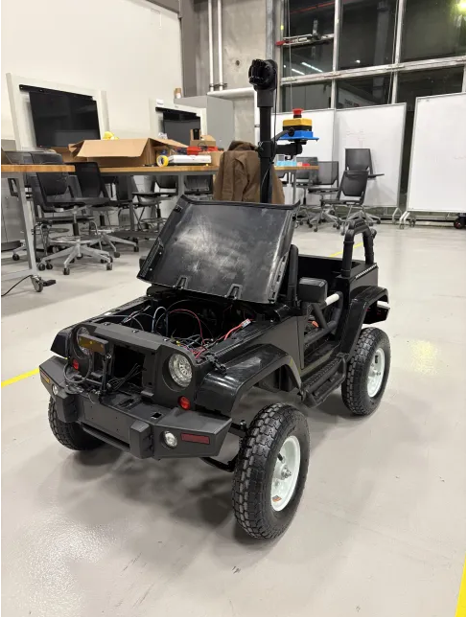

# Scale Autonomous Vehicle (ROS 2 + Jetson Orin Nano)

   
  <em>Ride-on scale vehicle with Jetson Orin Nano, OAK-D Lite depth camera, and Unitree L2 4D LiDAR.</em>

This repository contains a ROS 2 Humble workspace for a **scale autonomous vehicle** designed around IGVC-style tasks:

- Jetson Orin Nano as the onboard computer  
- OAK-D Lite depth camera for **lane detection**  
- Unitree L2 4D LiDAR for **obstacle detection / stop logic**  
- Arduino-based steering and traction controllers for motion commands  

The Jetson replaces an earlier laptop setup and allows the camera pipeline to run much faster (from ~0.9 Hz to ~19 Hz).

The project uses the **DepthAI** SDK for the OAK-D camera and the **Unitree `unilidar_sdk`** for the L1 LiDAR. Only my ROS 2 nodes and launch files are included here.

---

## Features

### Lane Keeping with OAK-D Lite

- Detects a **yellow lane line** in the camera image using HSV thresholding and region-of-interest cropping.  
- Computes a **lane center offset** from the image center.  
- When the yellow line appears inside the lane, the controller sends steering commands so the car moves **away from the line** and stays inside the lane corridor.
- **Demo video:**  [Lane Keeping](https://youtu.be/0kMUZiqIvLE)

---

### Obstacle Avoidance with Unitree L2 LiDAR
 
- A ROS 2 node reads `/unilidar/cloud` and computes the **minimum distance** in a configurable front sector.  
- If the distance drops below the **stop threshold** (≈ 3 ft), the node sets a stop flag and sends a **stop command** to the Arduino motor controller.  
- Used to meet IGVC-style qualification: vehicle must stop within ~3 ft of an obstacle.
- **Demo video:**  [Obstacle Avoidance](https://youtube.com/shorts/Plj8EsCJSZY?feature=share)

---

## Code Structure

This workspace currently has two main packages:

- **`igvc_lane`** – Lane detection and steering / speed control using the OAK-D Lite.  
- **`igvc_lidar`** – LiDAR-based obstacle detection and stop logic.  

